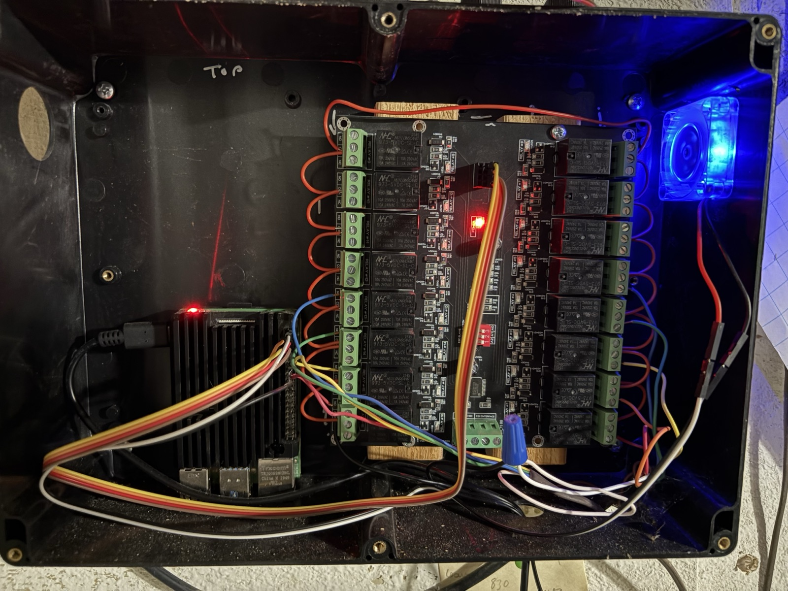
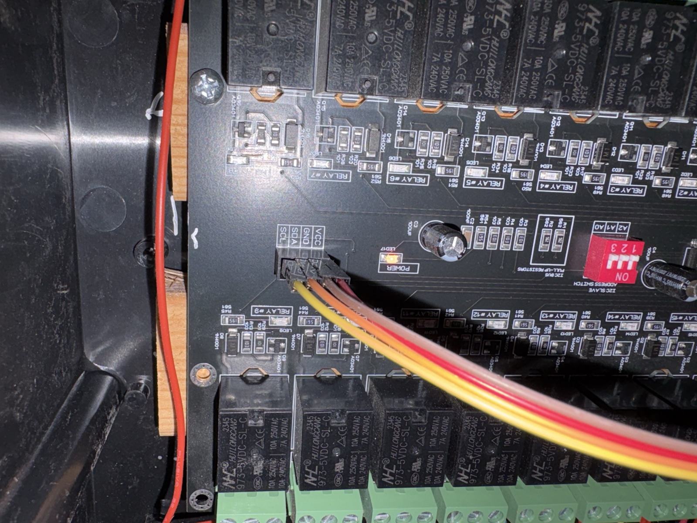
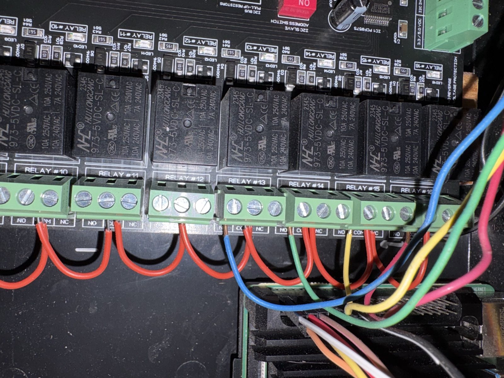
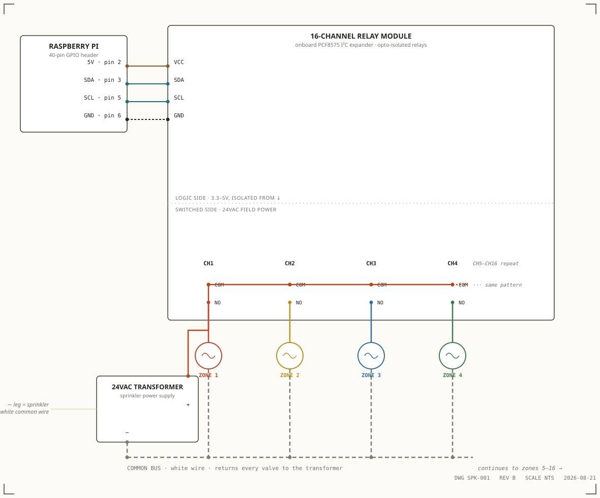

# Sprinklers 
---
# Development Getting Started

## base raspberryPi install
The `deploy/` folder has a script that installs nginx, the systemd service, the Python venv, and builds the frontend in one shot — see [`deploy/README.md`](deploy/README.md) for the full walkthrough:
```
sudo bash deploy/install.sh
```
Prefer to do it by hand? Keep reading below for the manual steps.

#### install nginx
```sudo apt-get install nginx```   
```sudo systemctl enable nginx```
## api
#### setup
I have a venv of sprinklers_venv (created at the project root, not inside `api/`):

``` python3 -m venv sprinklers_venv```  
``` source sprinklers_venv/bin/activate```
``` cd api ```  
``` pip3 install -r requirements.txt```

### i2c setup
The relay board (PCF8575) talks over I2C. Enable it once and confirm it's visible:
```
sudo raspi-config nonint do_i2c 0
sudo i2cdetect -y 1
# should show 0x27 in the grid
```

#### development of api
```uvicorn main:app --reload```  
http://localhost:8000   
http://localhost:8000/docs 

#### development off the Pi (e.g. on a Mac)
`smbus2` and the I2C bus only exist on the Pi. `main.py` detects when `smbus2` can't be imported and falls back to no-op hardware functions, so you can run the API anywhere for frontend/API work — the valve endpoints will just respond without actually switching anything.

## frontend
```
cd frontend
npm install
npm run dev
```
That starts the Vite dev server. `npm run build` produces the `dist/` folder that nginx serves in production — `deploy/install.sh` and `deploy/restart.sh` do this for you automatically.

---
# Hardware / Wiring

The controller talks to the relay board over I2C instead of driving GPIO pins directly (see "What was I thinking" below for why). You need:

- Raspberry Pi (4 or 5) with I2C enabled (`sudo raspi-config nonint do_i2c 0` — see the i2c setup step above)
- A PCF8575 16-bit I2C I/O expander relay board, at address `0x27` (A0–A2 jumpers/pins all HIGH) — [this is the one I used](https://www.amazon.com/gp/product/B084BR4TDH/)
- Relays are **active-LOW** — a pin driven LOW energizes that relay/valve
- The relay board's VCC comes off the Pi's **5V pin, not 3.3V** — that's what sidesteps the logic-level mismatch that killed the original raw-GPIO design (GPIO is 3.3V; the original relay needed 5V to trigger)
- 24VAC sprinkler valve wiring on the relay board's switched (COM/NO) side, fully isolated from the Pi/I2C side by the relay contacts themselves


*Pi (left) wired into the 16-relay PCF8575 board, mounted together in the enclosure.*


*The 4-pin SCL/SDA/GND/VCC header from the Pi, and the onboard address DIP switch (A0–A2) that sets the I2C address — `0x27` with all three OFF.*


*Sprinkler valve wires landed on the relay board's NO/COM/NC screw terminals.*


*Pi → I2C (VCC/SDA/SCL/GND) → relay module, with the 24VAC transformer's `+` leg daisy-chained through each relay's COM terminal, each relay's NO terminal feeding its zone valve, and every valve's return tied to the shared common (white) wire back to the transformer's `-` leg.*

### Before you wire this

- **Watch the I2C logic level.** The board's single VCC pin powers both the onboard PCF8575 and all 16 relay coils, so most combo boards like this one want 5V there. If SDA/SCL are pulled up to that same 5V VCC, the bus can feed 5V back into the Pi's 3.3V-only GPIO pins and damage them. Check whether your board already has level shifting on SDA/SCL (many sold for Raspberry Pi do) before powering on.
- **Confirm active-LOW vs active-HIGH.** Most boards like this one trigger LOW — setting a PCF8575 output bit to `0` energizes that channel's relay, `1` de-energizes it. `sprinklerfunctions.py` assumes active-LOW; confirm against your specific board before wiring anything live.
- **Confirm your I2C address.** This build has A0–A2 pulled HIGH via the onboard pull-up resistors (DIP switches OFF, see photo above), giving address `0x27` — that's what `sprinklerfunctions.py` uses. If your board grounds A0–A2 instead, the default is often `0x20`. Check your board and update `_I2C_ADDRESS` in `sprinklerfunctions.py` if it differs.

### Pi → relay module (I2C)

| Pi pin | Module |
|---|---|
| Pin 2 · 5V | VCC |
| Pin 3 · GPIO2 | SDA |
| Pin 5 · GPIO3 | SCL |
| Pin 6 · GND | GND |

Use 3V3 (pin 1) instead only if your board's docs confirm 3.3V logic *and* coil power.

### Field wiring per zone

| From | To |
|---|---|
| Transformer `+` | CH1 COM |
| CH1–CH16 COM | daisy-chained |
| CHn NO | Zone n valve |
| Every valve return | Transformer `−` (white/common) |

- The relay contacts provide electrical isolation, not just switching — the Pi and PCF8575 stay on the low-voltage logic side while a separate 24VAC circuit passes through the COM/NO contacts. Nothing on the field side touches the Pi's GPIO.
- AC has no true polarity, but sprinkler wiring treats one transformer leg as a fixed reference anyway — this build calls that leg "common," ties it to the white wire, and routes it back from every valve. The other leg is the one actually switched, zone by zone, through the relays.
- Daisy-chaining COM means one wire carries the transformer's switched leg to all 16 relays — jump COM on CH1 to COM on CH2, CH2 to CH3, and so on. NO and the zone wire are the only connections unique to each channel.
- NC terminals are unused and left disconnected.

---
# Features

- **Zones** — name a valve/relay port, set a default run duration, pick an icon/color. Run any zone manually, on demand, from the Daily Use screen.
- **Schedules** — group zones to run in sequence (not simultaneously) on chosen days of the week, at one or more start times per schedule.
- **Single-valve enforcement** — only one valve can be open at a time; the backend rejects a manual run if something else is already running, and schedules step through their zones one at a time.
- **Rain delay** — pulls current conditions and today's precipitation from Open-Meteo for your saved location; when enabled, a schedule is automatically skipped if rain is likely or the chance of rain crosses your configured threshold.
- **Live status** — a system status endpoint reports what's running right now (manual or scheduled), which zone, and how much time is left.
- **History** — every start/stop/skip (manual, scheduled, or rain-skipped) is logged and viewable as a running event history.
- **Crash-safe** — if the API restarts mid-run, it clears any in-progress state and shuts all valves off on startup rather than trusting stale state.
- **Runs without the hardware attached** — on anything other than the Pi (e.g. developing on a Mac), the backend detects that `smbus2`/I2C isn't available and falls back to no-op valve control, so the API, scheduler, and frontend all still work for development.

---
# What was I thinking when I built it?

I started working on this because I wanted to learn/build something IoT and it seemed like fun to control All (14 zones) of my sprinklers with a RaspberryPi. I worked on it on and off for a few years as my interest waxed and waned. Initially it was to be controlled via GPIO and mapped to relays. GPIO is interesting because ports and BCM don’t align so I started working on a mapping for the sprinkler zones, ports, and BCM. After getting all the APIs working with LEDs, I was able to demonstrate schedules, manual zone runs, and relay state. And then before I could test the 24VAC to run the sprinklers … I realized that GPIO is only 3.3V and the relay I purchased required 5V.  

I did some research and moved onto a new relay board that supported SPI/I2C. Once I got that working and wired up.. I leveraged claude to help build a front-end and ensure that my contracts were solid between the API and front-end.  This is what you’re looking at. 
